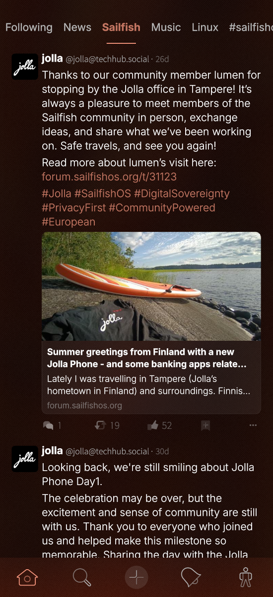

## Meridon

Meridon is a native Mastodon client with Lists support. It allows you to create lists, add users to the lists. The home view is a swipeable carousel view of your Following feed and your favorite list feeds and hastags.

Main features:
- Supports all Mastodon Browse functions (incl. trending posts, hashtags, and links, plus suggested accounts to follow)
- Quick access to your Lists and followed hashtags from the home carousel
-  Open Mastodon links from elsewhere in Sailfish OS (browser, notifications) directly in Meridon instead of a browser tab
-   Optional colourful emoji, including your server's custom emoji
-   Custom font support for reading posts
-   Four appearance presets: Native, More contrast, Mastodon, and Custom

Not implemented yet:
- Multi account switching
- OS-level push notifications

This application development is AI assisted and the library parts are mostly vibecoded.

